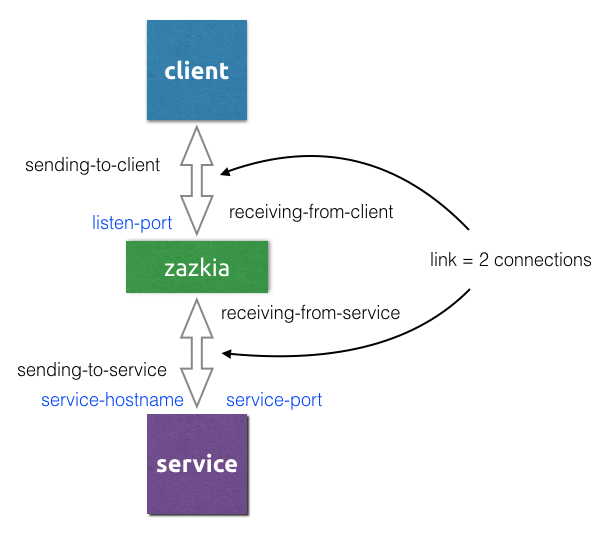

> zazkia
is a tool that simulates all kinds of connection problems with a tcp connection (reset,delay,throttle,corrupt).

### How does it work ?
In order to apply misbehavior, zazkia must be used as a proxy between a client and service.
It will accept tcp connections from a client and for each new one, will create a connection to the target service.

### Routes
By specifying routes, you can tell zazkia on what ports to listen and what target to connect to (host and port).

Minimal zazkia-routes.json example

	[
	    {
	        "label": "oracle",
	        "service-hostname": "some.host.name",
	        "service-port": 1521,
	        "listen-port": 49997
	    }
	]

With this route definition, your application should use "localhost:49997" instead of "some.host.name:1521" in the connection specification.
Your application (the client) will setup a tcp connection with zazkia which will setup another tcp connection to oracle (the service).

#### Initial transport behavior
The transport part of a route configuration can be used to setup the initial behavior of a new connection pair (called link).
Using a REST api, the transport behavior can be changed on a per-link basis.

Full zazkia-routes.json example

	[
	    {
	        "label": "postgresql",
	        "service-hostname": "some.other.host.name",
	        "service-port": 5432,
	        "listen-port": 49998,
	        "transport": {
				"accept-connections": true,
				"throttle-service-response": 1000,
				"delay-service-response": 100,
				"service-response-corrupt-method": "randomize",
				"sending-to-client": true,
				"receiving-from-client": true,
				"sending-to-service": true,
				"receiving-from-service": true,
				"verbose": true
	        }
	    }
	]

| transport property | comment | default, effective values |
|-----------|---------|--------|
| accept-connections | whether connections from the client are accepted | **true**, false |
| throttle-service-response | bytes per second | **0**, positive integer |
| delay-service-response | milliseconds delay | **0**, positive integer |
| service-response-corrupt-method | how the bytes are mangled | **empty**, randomize |
| sending-to-client | whether a response from the service is sent back to the client | **true**, false |
| receiving-from-client | whether a request from the client is read | **true**, false |
| sending-to-service | whether a request from the client is sent to the service | **true**, false |
| receiving-from-service | whether a response from the service is read | **true**, false |

### Build

To build the project locally and test it.

	go get -u github.com/jteeuwen/go-bindata/...

	go generate
	go test
	go build

## Run

Defaults (-p 9191 -f zazkia-routes.json)

	./zazkia

### Dashboard
A simple HTML dashboard is available to change the transport behavior of individual links.

	http://localhost:9191
	
	
### REST API

Get all routes

	GET http://localhost:9191/routes

Get all links

	GET http://localhost:9191/links
	

Close link
For one route, multiple connection pairs (link) could be created. Each link has an unique sequence number **id**.

	POST http://localhost:9191/links/{id}/close
	
Toggle accept connections for route

	POST http://localhost:9191/routes/{label}/toggle-accept
		

Delay transport of response data from service to client (parameter "ms" in milliseconds)

	POST http://localhost:9191/links/1/delay-response?ms=1000

	
Toggle enable receive or sent via link (both from client and service)	

	POST http://localhost:9191/links/1/toggle-reads-client
	POST http://localhost:9191/links/1/toggle-writes-service
	POST http://localhost:9191/links/1/toggle-reads-service
	POST http://localhost:9191/links/1/toggle-writes-client	

Toggle verbose logging of data transport via link

	POST http://localhost:9191/links/1/toggle-verbose

		
Get transport statistics of a link

	GET http://localhost:9191/links/1/stats
	